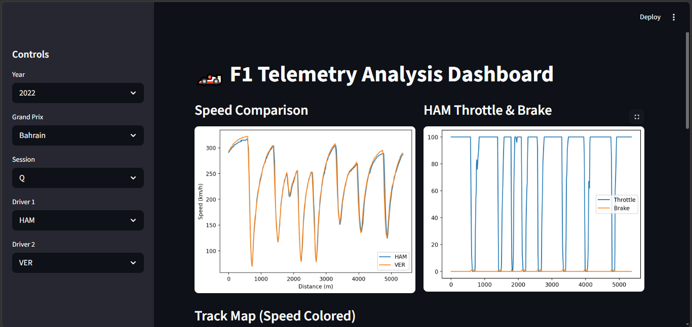
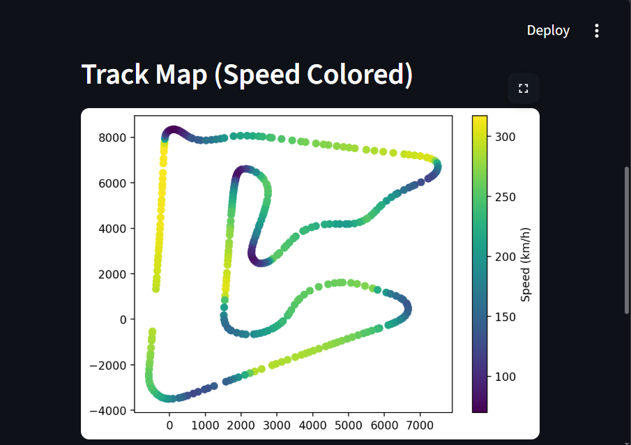
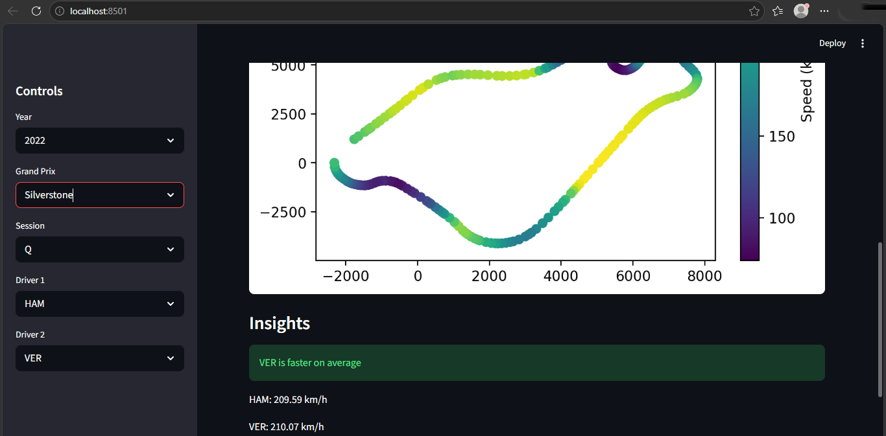

## 🏎️ F1 Telemetry Analysis Dashboard 🏁

A professional-grade telemetry analysis tool built using real Formula 1 race data to compare driver performance through interactive visualizations.

Inspired by real engineering workflows used in Formula 1.

## 🚀 Features
- 📊 Driver vs Driver comparison
- 📈 Speed analysis across lap distance
- 🏎️ Throttle & brake visualization
- 🗺️ Track map with speed heat visualization
- 🧠 Performance insights

## 🛠️ Tech Stack
- Python
- FastF1
- Pandas
- Matplotlib
- Streamlit

## 📂 Project Structure

F1-Telemetry-Analysis/
│── app.py
│── main.py
│── src/
│── assets/
│── requirements.txt
│── README.md


## 📸 Dashboard Preview






## 🧠 Key Insights Generated

- Compare driver speed across lap distance  
- Analyze throttle and braking patterns  
- Identify performance differences across track sections  
- Visualize track layout with speed heatmap 

## 🌐 Live Demo
(http://localhost:8501/)

🧠 Use Case

This project simulates telemetry analysis used in Formula 1 to compare driver performance and optimize racing strategies.

## 💡 Future Improvements

- 📊 Lap Delta Comparison: Visualize time difference between drivers across the lap
- 🧩 Sector Analysis: Compare performance across track sectors (S1, S2, S3)
- 🌐 Live Deployment: Host the app using Streamlit Cloud for public access
- 📈 Multi-driver comparison: Compare more than two drivers simultaneously
- 🎮 Race Replay System: Animate car movement and race progression

## ▶️ How to Run
```bash
pip install -r requirements.txt
python -m streamlit run app.py
